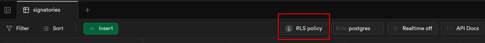

## Setting up Supabase:

To start you will need to set up the backend on Supabase and get the API info

1. Create account  
2. Create new organization  
   1. Free tier is fine  
3. Create new project in organisation  
   1. Change region to EU option (I chose EU-west)  
   2. The other default settings for the new project are fine   
4. Create database for project  
   1. Copy contents of `generate_schema.sql` file in the EEG100Manifesto repo  
   2. Paste in Supabase ‘SQL editor’ and execute  
      1. 3rd icon down on left-hand side-bar  
      2. Create new private snippet  
      3. Paste and execute (Ctrl \+ Return)  
   3. Double check it has been created correctly  
      1. Should be a table called signatories visible in the ‘Table editor’ (2nd icon on left side)  
      2. When clicked there should be a button for RLS policy that looks like image below:

5. Get the following from Supabase:  
   1. DB URL:  
      - Project settings \> Data API  
      - Project URL (i.e. [https://liycjkfzezooeydblbba.supabase.co](https://liycjkfzezooeydblbba.supabase.co))  
   2. `secret_key:`  
      - Project settings \> API Keys \> API keys (not Legacy)  
      - Secret keys (scroll to bottom)  
   3. `publishable_key:`  
      - Project settings \> API Keys \> API keys (not Legacy)  
      - Publishable key

## Adjusting the Github code:

Once you have the database set up you need to adjust 2 things in the Github repo so it can read/write the database.

### 1\. Update Github actions secrets

Add the DB URL and `secret_key` as Github secrets so that the responses can be read from the DB when the site is rebuilt.

1. Go to the Secrets section for Github actions  
   - Settings \> Secrets and variables \> Actions  
2. Create two new repository secrets:  
   - Name: SUPABASE\_SERVICE\_ROLE\_KEY  
  Secret: `secret_key`  
   - Name: SUPABASE\_URL  
  Secret: DB URL

### 2\. Update the frontend code

Add the DB URL and `publishable_key` to the frontend code so that responses can be added to the DB.

1. Go to EEG100Manfiesto/docs/javascript/extra\_javascript.js  
2. Replace the values of two variables:
   - Replace the value of the  `supabase_key` const with your `publishable_key`  
   - Replace the value of the `supabase_url` const with your DB URL (same as above)
